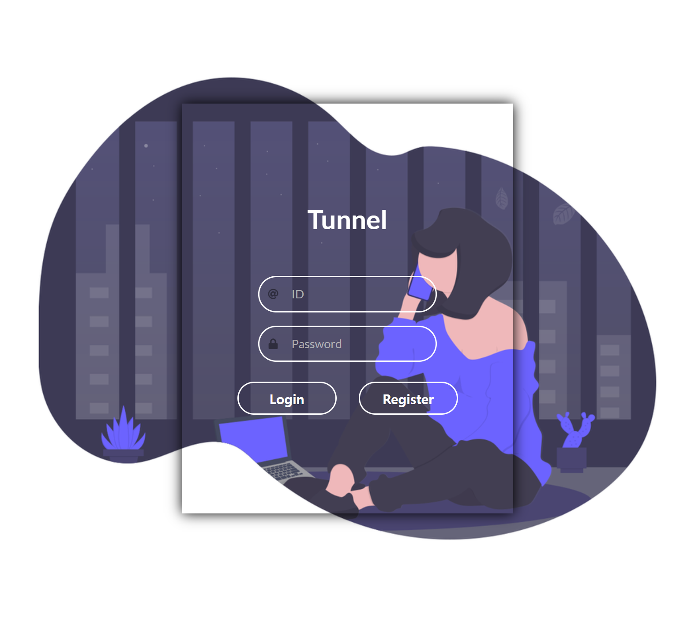
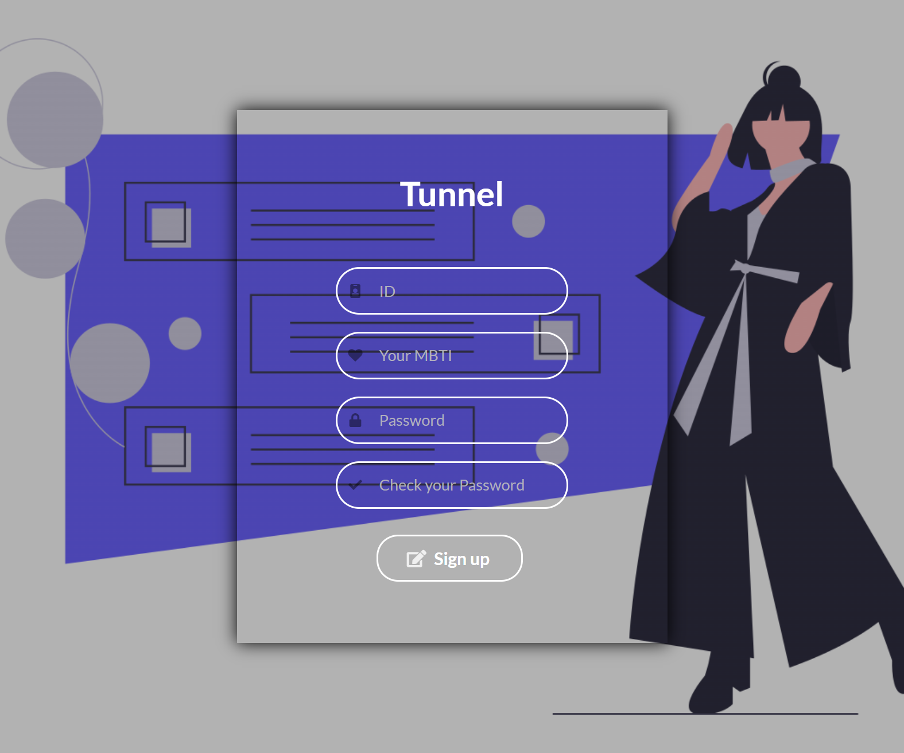

<div id="top"></div>
<!--
*** Thanks for checking out the Best-README-Template. If you have a suggestion
*** that would make this better, please fork the repo and create a pull request
*** or simply open an issue with the tag "enhancement".
*** Don't forget to give the project a star!
*** Thanks again! Now go create something AMAZING! :D
-->


<!-- PROJECT SHIELDS -->
<!--
*** I'm using markdown "reference style" links for readability.
*** Reference links are enclosed in brackets [ ] instead of parentheses ( ).
*** See the bottom of this document for the declaration of the reference variables
*** for contributors-url, forks-url, etc. This is an optional, concise syntax you may use.
*** https://www.markdownguide.org/basic-syntax/#reference-style-links
-->

<!-- PROJECT LOGO -->
<br />
<div align="center">
  <a href="http://khuhub.khu.ac.kr/2019102198/Tunnel.git">
    
  </a>

<h1 align="center">익명 고민상담 서비스</h1>
</div>


<!-- TABLE OF CONTENTS -->
<br>
  <h3>목차</h3>
  <ol>
    <li>
      <a href="#about-the-project">About The Project</a>
      <ul>
        <li><a href="#built-with">Built With</a></li>
      </ul>
    </li>
    <li>
      <a href="#getting-started">Getting Started</a>
      <ul>
        <li><a href="#installation">Installation</a></li>
        <li><a href="#prerequisites">Prerequisites</a></li>
      </ul>
    </li>
    <li><a href="#usage">Usage</a></li>
    <li><a href="#roadmap">Roadmap</a></li>
    <li><a href="#contributing">Contributing</a></li>
    <li><a href="#license">License</a></li>
    <li><a href="#contact">Contact</a></li>
  </ol>
</br>


<!-- ABOUT THE PROJECT -->
## About The Project

> 터널과 같이 앞길이 깜깜한 인생 고민, mbti와 아이디 비밀번호만 입력하면 익명의 사용자들에게 고민 상담을 받을 수 있습니다!


<p align="right">(<a href="#top">back to top</a>)</p>


### Built With

> * [React.js](https://reactjs.org/) -- front end
> * [Node.js](https://nodejs.org/) -- back end
> * [MySQL](https://www.mysql.com/) -- database
> * [AWS](https://aws.amazon.com/) -- server


<p align="right">(<a href="#top">back to top</a>)</p>


<!-- GETTING STARTED -->
## Getting Started

* Install

> 1. Git
> 2. Node JS
> 3. MySQL

### Installation

1. Clone repository
   ```sh
   git clone http://khuhub.khu.ac.kr/2019102198/Tunnel.git
   ```
2. Install NPM packages
   ```sh
    PS C:\Users\seano\Desktop\git_OSS\OSS project\Tunnel> cd tunnel_BE
    PS C:\Users\seano\Desktop\git_OSS\OSS project\Tunnel\tunnel_BE> cd server
    PS C:\Users\seano\Desktop\git_OSS\OSS project\Tunnel\tunnel_BE\server> npm install
   ```
   ```sh
    PS C:\Users\seano\Desktop\git_OSS\OSS project\Tunnel\tunnel_BE\server> cd ..  
    PS C:\Users\seano\Desktop\git_OSS\OSS project\Tunnel\tunnel_BE> cd..
    PS C:\Users\seano\Desktop\git_OSS\OSS project\Tunnel> cd turnel_FE
    PS C:\Users\seano\Desktop\git_OSS\OSS project\Tunnel\turnel_FE> npm install 
   ```

<p align="right">(<a href="#top">back to top</a>)</p>

### Prerequisites
* Login MySQL / Create database
   ```sh
    윈도우 + R ---> cmd 실행창 열기
   ``` 
   ```sh
    C:\Users\seano>cd..
    C:\Users>cd..
    C:\>cd "Program Files"
    C:\Program Files>cd MySQL
    C:\Program Files\MySQL>cd "MySQL Server 8.0"
    C:\Program Files\MySQL\MySQL Server 8.0>cd bin
    C:\Program Files\MySQL\MySQL Server 8.0\bin>mysql -h localhost -u root -p
    Enter password: **********
    Welcome to the MySQL monitor.  Commands end with ; or \g.
    Your MySQL connection id is 27
    Server version: 8.0.19 MySQL Community Server - GPL

    Copyright (c) 2000, 2020, Oracle and/or its affiliates. All rights reserved.

    Oracle is a registered trademark of Oracle Corporation and/or its
    affiliates. Other names may be trademarks of their respective
    owners.

    Type 'help;' or '\h' for help. Type '\c' to clear the current input statement.

    mysql> CREATE SCHEMA tunnel DEFAULT CHARACTER SET utf8;
    Query OK, 1 row affected, 1 warning (0.04 sec)
   ```
* 내용
  ```sh
  내용
  ```

<!-- USAGE EXAMPLES -->
## Usage
> ### 용도 설명

> #### 1. Login Page


> #### 2. Register Page


> #### 3. User board Page

<p align="right">(<a href="#top">back to top</a>)</p>


<!-- ROADMAP -->
## Roadmap

> - 로그인 기능 구현
> - 회원가입 기능 구현 (Id, mbti, password 입력)
> - 사용자 게시판 구현
>    - [x] mbti 사용한 매칭 기능
>    - [o] 내용

<p align="right">(<a href="#top">back to top</a>)</p>


<!-- CONTRIBUTING -->
## Contributing

게시판에 아이디어를 추가하고 싶다면...

> 1. Fork the Project
> 2. Create your Feature Branch (`git checkout -b feature/"추가된 아이디어 이름"`)
> 3. Commit your Changes (`git commit -m 'Added features`)
> 4. Push to the Branch (`git push origin feature/"추가된 아이디어 이름"`)
> 5. Open a Pull Request

<p align="right">(<a href="#top">back to top</a>)</p>


<!-- LICENSE -->
## License

Distributed under the [MIT License](License).

<p align="right">(<a href="#top">back to top</a>)</p>


<!-- CONTACT -->
## Contact

> - 오인제 (seanoh@khu.ac.kr)
> - 정의왕 (@khu.ac.kr)
> - 고병후 (@khu.ac.kr)

Project Link: [http://khuhub.khu.ac.kr/2019102198/Tunnel.git](http://khuhub.khu.ac.kr/2019102198/Tunnel.git)

<p align="right">(<a href="#top">back to top</a>)</p>